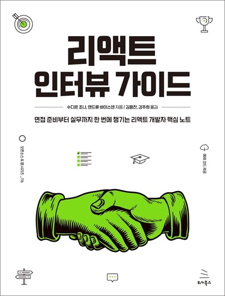

# 리액트 인터뷰 가이드
### 면접 준비부터 실무까지 한 번에 챙기는 리액트 개발자 핵심 노트

- **수디르 조나, 앤드류 바이스덴** 지음 | **김용찬, 강주희** 옮김
- ISBN: 9791158395377
- 판형: 188\*240\*16mm
- 28,000원 | 2024년 8월 21일 발행 | 380쪽
- [책 홈페이지](https://wikibook.co.kr/react-interview-guide/)
- [도서 미리보기](https://www.yes24.com/Product/Viewer/Preview/130271536)
- [도서 관련 문의](https://wikibook.co.kr/support/contact/)

---

**총 223개에 달하는 리액트 개발자 면접 질문을 통해 리액트와 프런트엔드 개발 지식을 한 단계 업그레이드하세요!**

《리액트 인터뷰 가이드》는 리액트 생태계와 최신 리액트 개발 동향에 대해 종합적으로 다룬다. 이 책을 통해 리액트 개발에 필수적인 기술과 팁을 통해 앞으로 겪을 다양한 상황에 신속하게 대응할 수 있는 능력을 키울 수 있다.

또한 리액트 개발자 면접을 준비하는 프런트엔드 개발자 꿈나무들뿐만 아니라 이미 경험 많은 개발자들도 리액트 지식을 확장할 수 있도록 리액트 면접에서 자주 등장하는 질문과 테스팅, Next.js 앱 구축과 같은 중요 기술들을 함께 다룬다.

이 책을 통해 리액트 직무 면접에 대한 자신감을 쌓고, 리액트 개발자로서 한 단계 더 나아갈 수 있을 것이다.

**★ 이 책에서 다루는 내용 ★**

- 경쟁이 치열한 시장에서 프로필을 빛나게 할 최신 전략
- 기초부터 고급까지, 다양한 면접 질문에 대비하고 리액트 개발자 직무를 얻는 방법
- 리액트의 최신 기능, 성능 최적화, 디버깅 기술
- 리액트 개발자에게 필수적인 기술과 팁
- 다양한 프레임워크와 라이브러리를 이해하고 리액트 면접 질문에 대비하는 법
- 완벽한 리액트 기반 애플리케이션을 구축하고 코딩 과제에서 뛰어난 성과를 거두는 방법

---
## 리액트 개발자 질문 목록

- [리액트 개발자 질문 목록](questions.md)

---
 
 ## 구입처
 
 - [예스24](https://www.yes24.com/Product/Goods/130271536)
 - [교보문고](https://product.kyobobook.co.kr/detail/S000214006794)
 - [알라딘](https://www.aladin.co.kr/shop/wproduct.aspx?ItemId=344584446)
